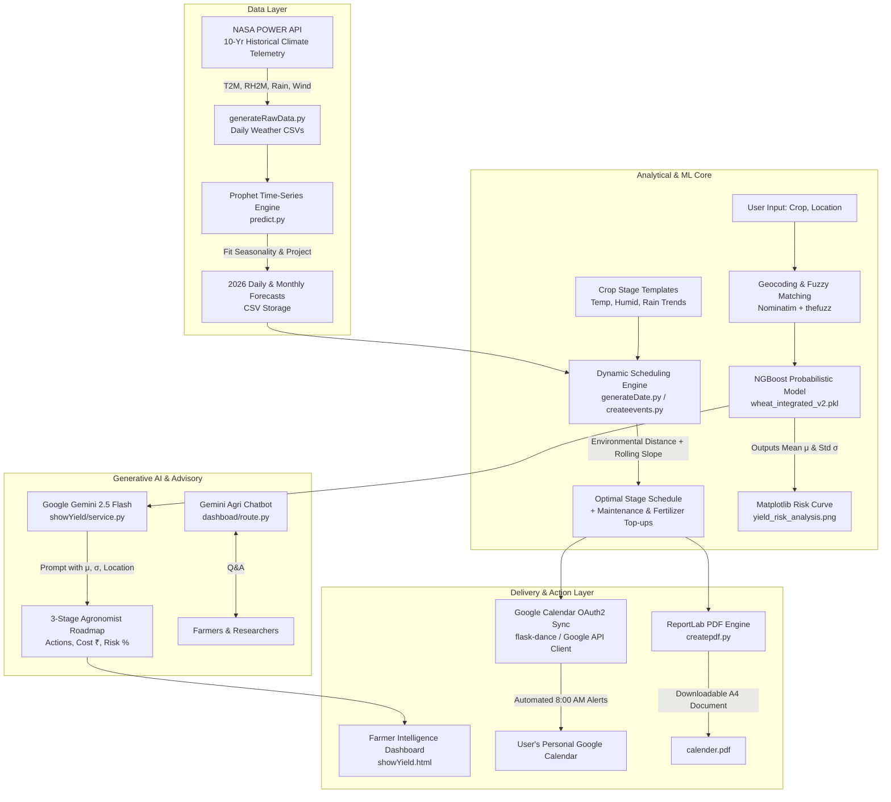

# 🌾 Climate-Based Crop Probabilistic Model & Agricultural Intelligence System

[](https://www.python.org/)
[](https://palletsprojects.com/p/flask/)
[](https://facebook.github.io/prophet/)
[](https://github.com/stanfordmlgroup/ngboost)
[](https://ai.google.dev/)
[](https://power.larc.nasa.gov/)
[](LICENSE)

An end-to-end, climate-adaptive agricultural decision support platform. By synthesizing **10-year NASA satellite climate data**, **Prophet time-series forecasting**, **NGBoost probabilistic yield distribution modeling**, **dynamic environmental-distance phenological scheduling**, **Google Calendar API automation**, and **Google Gemini Generative Agronomy**, this system replaces static farming calendars with adaptive, risk-quantified agricultural planning.

---

## 📑 Table of Contents

- [Overview](#-overview)
- [System Architecture & Data Flow](#-system-architecture--data-flow)
- [Core Features](#-core-features)
- [How It Works: Step-by-Step Functioning](#-how-it-works-step-by-step-functioning)
- [Mathematical & Statistical Formulations](#-mathematical--statistical-formulations)
- [Supported Crops & Growth Profiles](#-supported-crops--growth-profiles)
- [Project Directory Structure](#-project-directory-structure)
- [Technology Stack](#-technology-stack)
- [Installation & Quickstart](#-installation--quickstart)
- [Environment Configuration (`.env`)](#-environment-configuration-env)
- [Executing Data Pipelines & ML Models](#-executing-data-pipelines--ml-models)
- [API & Route Reference](#-api--route-reference)
- [Demo Credentials](#-demo-credentials)
- [Troubleshooting & FAQs](#-troubleshooting--faqs)
- [License](#-license)

---

## 🌍 Overview

Traditional farming advice relies on static calendar dates that fail under increasing climate variability and erratic seasonal transitions. Furthermore, standard machine learning models produce deterministic point estimates of crop yield without uncertainty bounds, leaving farmers and agricultural lenders vulnerable to unquantified financial and climate risks.

**The Climate-Based Crop Probabilistic Model** addresses this challenge through three primary innovations:

1. **Probabilistic Yield Forecasting**: Instead of predicting a fixed metric (e.g., "$3.2\text{ T/Ha}$"), the platform employs **NGBoost (Natural Gradient Boosting)** to predict full conditional probability distributions $\mathcal{N}(\mu, \sigma^2)$, providing both the **expected yield ($\mu$)** and the **associated uncertainty/risk ($\sigma$)**.
2. **Climate-Adaptive Phenological Dating**: Rather than planting on fixed calendar days, the engine uses **Facebook Prophet** to forecast daily weather through 2026 based on 10-year NASA satellite reanalysis, calculating the exact date that minimizes the **environmental distance** (temperature, humidity, and rainfall slope trend) for each crop growth phase.
3. **Closed-Loop Execution & AI Advisory**: The resulting schedule is automatically synchronized to the farmer's **Google Calendar** with time-stamped notifications for fertilizer doses and irrigation checks, rendered into an archival **ReportLab PDF**, and paired with stage-by-stage agronomic advisories generated by **Google Gemini AI**.

---

## 🏗 System Architecture & Data Flow



---

## ✨ Core Features

### 1. Probabilistic Crop Yield Prediction (NGBoost)
- Utilizes Natural Gradient Boosting for probabilistic regression over agricultural data (state, district, crop type, season, area, annual rainfall, fertilizer, and pesticide usage).
- Outputs the **conditional mean yield ($\mu$)** in Tonnes/Hectare alongside the **standard deviation ($\sigma$)**, quantifying the confidence gap and climate volatility risk.
- Dynamically renders a Gaussian probability density curve ($\mathcal{N}(\mu, \sigma^2)$) showing the distribution profile, 4-sigma boundary spread, and expected yield marker.

### 2. Multi-Variate Climate Forecasting (Facebook Prophet + NASA POWER)
- Ingests 10 years of solar and meteorological telemetry directly from the **NASA Langley Research Center POWER API**:
  - `T2M`: Temperature at 2 Meters (°C)
  - `T2M_MAX` / `T2M_MIN`: Maximum & Minimum Temperatures
  - `RH2M`: Relative Humidity at 2 Meters (%)
  - `PRECTOTCORR`: Precipitation / Rainfall (mm/day)
  - `WS10M`: Wind Speed at 10 Meters (m/s)
- Fits univariate **Prophet** models capturing yearly seasonality and auto-generates both daily and monthly projections for target regions through 2026.

### 3. Dynamic Environmental Distance Phenological Scheduling
- Evaluates ideal crop physiological requirements against projected climate conditions.
- Uses a weighted Euclidean environmental distance metric to find the optimal day within the target season.
- Employs a 7-day rolling window linear regression slope filter to verify micro-trends (e.g., ensuring increasing rainfall trends for Kharif transplanting or cooling temperatures for Rabi sowing).
- Automatically synthesizes recurring maintenance routines (irrigation ponding depth checks every 4–7 days and nitrogen/urea fertilizer top-up reminders mid-stage).

### 4. Direct Google Calendar Integration & PDF Publishing
- **Google Calendar OAuth2 Sync**: Using Flask-Dance and the Google Calendar API v3, schedules are exported directly to the farmer's Google Calendar with timestamps (8:00 AM), detailed requirement descriptions, and default reminders.
- **ReportLab PDF Generator (`createpdf.py`)**: Automatically compiles a clean, printable 12-month agricultural calendar formatted to A4 dimensions with color-coded event boxes and requirement callouts.

### 5. Generative Agronomy Advisory (Google Gemini)
- Transforms statistical predictions into actionable farm management guidance via **Gemini 2.5 Flash**.
- Formulates a structured 3-stage roadmap with specific interventions, projected capital costs (in Indian Rupees ₹), and quantified risk probabilities.
- Provides interactive, in-app conversational assistance across the dashboard and calendar interfaces.

### 6. Dual-Persona Portals & Multilingual Voice Search
- **Farmer Portal**:
  - Interactive crop slider supporting **Wheat, Rice, Potato, Onion, and Moong**.
  - Live field telemetry (soil health, moisture, NPK requirements, 7-day weather outlook).
  - **Bengali Voice Search**: Web Speech API integration (`bn-IN`) mapping spoken Bengali crop queries (e.g., *গম*, *ধান*, *আলু*, *পেঁয়াজ*, *মুগ*) into English platform parameters.
- **Researcher & Scientist Portal (RECH Terminal)**:
  - Advanced meteorological workstation with live interactive satellite/radar telemetry powered by an embedded ECMWF Windy engine.
  - Atmospheric flux telemetry monitoring.
  - Research soil data CSV upload pipeline with automated **$Z$-score outlier filtering** ($|z| \le 3$) to eliminate corrupt readings.

---

## 🔄 How It Works: Step-by-Step Functioning

### Stage 1: Meteorological Telemetry Ingestion
1. A target coordinate is chosen (e.g., Kolkata, Delhi, Mumbai, Pune, Bangalore).
2. `services/weatherpredict/generateRawData.py` queries the NASA POWER API across a 10-year historical daily window.
3. NASA `-999` null markers are sanitized, and the verified records are written to `services/weatherpredict/rawData/{city}.csv`.

### Stage 2: Time-Series Forecasting
1. `services/weatherpredict/predict.py` reads the historical time series.
2. For each climate parameter (`Temp_Avg`, `Rainfall`, `Humidity`, `Wind_Speed`), a Prophet model is fitted with yearly seasonality.
3. Projections are computed daily through December 31, 2026, generating `kolkata_daily_2026_forecast.csv` and `kolkata_monthly_2026_prediction.csv`.

### Stage 3: Geographic Resolution & Probabilistic Yield Estimation
1. On `/showYield`, the user submits a crop name and location (e.g., `Wheat`, `Nagpur`).
2. `showYield/route.py` geocodes the location using Nominatim to extract latitude and longitude.
3. In `showYield/service.py`, reverse geocoding extracts the state and district names.
4. `thefuzz` matches the raw strings against the label encoders (`le_state`, `le_dist`, `le_crop`, `le_season`) stored inside `wheat_integrated_v2.pkl`.
5. The pre-trained NGBoost model predicts the distribution $y \sim \mathcal{N}(\mu, \sigma^2)$.
6. Matplotlib generates a probability density plot saved to `static/yield_risk_analysis.png`.
7. Google Gemini 2.5 generates a stage-by-stage agronomic strategy formatted as JSON.

### Stage 4: Phenological Date Calculation & Task Generation
1. `services/createevents.py` retrieves the crop's physiological blueprint.
2. For each phase, the target month's predicted weather slice is evaluated with the **Environmental Distance Formula**.
3. A 7-day rolling window checks the rain slope (increasing for monsoon crops) and temperature slope (decreasing for winter crops).
4. The exact day with the lowest distance penalty is chosen as the critical start date.
5. Secondary events are generated for the duration of the stage:
   - Irrigation checks every 4 to 7 days.
   - Secondary fertilizer doses midway through the stage.

### Stage 5: Calendar Dispatch & Export
1. When the user selects **"Download Calendar PDF & Sync"**:
   - `calender/route.py` builds the ReportLab PDF and streams `calender.pdf` to the browser.
   - The user is redirected to `/calendar/create_events`, initiating Google OAuth2 via Flask-Dance.
   - All events are committed to the user's primary Google Calendar as discrete entries at 08:00 AM IST.

---

## 📐 Mathematical & Statistical Formulations

### 1. Probabilistic Yield Formulation (NGBoost)
Unlike ordinary least squares or standard gradient boosting that estimate the conditional expectation $\mathbb{E}[Y \mid X]$, NGBoost models the entire conditional probability distribution:

$$P(Y \mid X = x) = \mathcal{N}\left(\mu(x),\, \sigma^2(x)\right)$$

The model employs natural gradients to optimize parameters on the Riemannian manifold of probability distributions:

$$\tilde{\nabla}_{\theta} \mathcal{L}(\theta, y) = \mathcal{I}(\theta)^{-1} \nabla_{\theta} \mathcal{L}(\theta, y)$$

Where $\mathcal{I}(\theta)$ is the Fisher Information Matrix and $\mathcal{L}$ is the negative log-likelihood scoring rule. This directly yields:
- **Expected Yield**: $\mu = \text{y\_dist.loc}[0]$
- **Yield Volatility / Risk**: $\sigma = \text{y\_dist.scale}[0]$

### 2. Environmental Distance Objective
To identify the optimal start date for a phenological stage within candidate month $M$, the algorithm minimizes the composite environmental penalty:

$$\mathcal{D}(d) = \left| T_{\text{avg}}(d) - T_{\text{target}} \right| + 0.5 \cdot \left| H(d) - H_{\text{target}} \right|$$

Subject to the trend constraint:

$$\text{Sign}\left(\text{Slope}_{7\text{d}}(d)\right) = \text{Trend}_{\text{required}}$$

Where the 7-day rate of change (slope) is computed via first-degree polynomial regression:

$$\text{Slope}_{7\text{d}} = \frac{\sum_{i=1}^{7} (i - \bar{i})(y_i - \bar{y})}{\sum_{i=1}^{7} (i - \bar{i})^2}$$

### 3. Researcher Soil Data Quality Assurance ($Z$-Score Filtering)
Uploaded soil mineral datasets undergo automated statistical outlier rejection:

$$Z_i = \frac{x_i - \mu_{\text{mineral}}}{\sigma_{\text{mineral}}}$$

Data points satisfying $|Z_i| > 3$ are flagged as anomalous (deviated sensor readings or contamination) and discarded prior to model ingestion.

---

## 🌾 Supported Crops & Growth Profiles

The rule engine in `services/createevents.py` includes calibrated baseline parameters for five major agricultural commodities:

| Crop | Stages Supported | Target Temp (°C) | Target Humidity (%) | Rain Trend Constraint | Recommended Nitrogen (Urea) | Target Water Depth |
| :--- | :--- | :--- | :--- | :--- | :--- | :--- |
| **Rice** (*Kharif*) | Land Prep, Transplanting, Tillering, Harvest | 24°C – 29°C | 60% – 86% | Positive (Monsoon) | 0 – 30 kg/ha | 0 – 5 cm |
| **Wheat** (*Rabi*) | Sowing, Tillering, Booting, Harvest | 14°C – 22°C | 40% – 60% | Negative (Cooling) | 0 – 25 kg/ha | 0 – 3 cm |
| **Potato** | Planting, Earthing Up, Bulb Formation, Harvest | 16°C – 20°C | 50% – 70% | Mixed | 0 – 20 kg/ha | 0 – 4 cm |
| **Onion** | Transplanting, Bulb Development, Curing, Harvest | 18°C – 23°C | 40% – 65% | Negative | 0 – 15 kg/ha | 0 – 3 cm |
| **Moong** (*Green Gram*) | Sowing, Flowering, Pod Filling, Harvest | 26°C – 29°C | 60% – 80% | Positive | 0 – 10 kg/ha | 0 – 4 cm |

---

## 📂 Project Directory Structure

```text
Climate-based-crop-probabilistic-model/
├── app.py                             # Main Flask application entry point & blueprint registry
├── createpdf.py                       # ReportLab PDF compilation engine for production calendars
├── requirements.txt                   # Complete Python dependencies
├── .gitignore                         # Git tracking ignore rules
├── README.md                          # Comprehensive project documentation
│
├── auth/                              # Authentication & Authorization Blueprint
│   ├── route.py                       # Google OAuth2 (Flask-Dance), mock auth, password reset
│   └── templates/
│       └── reset_password.html        # Secure password reset page
│
├── calender/                          # Calendar Synchronization Blueprint
│   └── route.py                       # Google Calendar API event insertion, PDF streaming, Gemini chat
│
├── dashboad/                          # Farmer Dashboard Blueprint
│   ├── route.py                       # Dashboard rendering & Gemini chatbot API (/chatbot)
│   ├── static/
│   │   ├── css/style.css              # Dashboard styling
│   │   ├── images/                    # UI icons & crop photography (wheat, rice, potato, etc.)
│   │   └── js/script.js               # Dynamic carousel, Bengali voice recognition, live field cards
│   └── templates/
│       └── dashboard.html             # Farmer dashboard HTML template
│
├── home/                              # Home & Landing Blueprint
│   ├── route.py                       # Route controllers for role-based homepages & login
│   ├── static/                        # Landing page assets
│   └── templates/
│       ├── index.html                 # Public farmer landing portal
│       ├── login.html                 # Unified multi-role login interface
│       └── researcher.html            # Researcher portal hub
│
├── navigation/                        # Researcher Meteorological Terminal Blueprint
│   ├── route.py                       # Terminal routes, weather data API, soil research CSV upload
│   ├── static/                        # Meteorological styling and scripts
│   └── templates/
│       ├── navigation.html            # Advanced RECH meteorological workstation with Windy iframe
│       ├── index.html                 # Terminal view
│       ├── script.js                  # Telemetry handlers
│       └── style.css                  # Terminal styles
│
├── services/                          # Core Data & Modeling Engines
│   ├── __init__.py
│   ├── createevents.py                # Schedule compiler & Google Calendar event formatter
│   └── weatherpredict/                # Climate ingestion & forecasting pipelines
│       ├── generateRawData.py         # NASA POWER API daily climate telemetry extractor
│       ├── predict.py                 # Multi-variable Facebook Prophet forecasting engine
│       ├── generateDate.py            # Environmental distance & rolling regression slope calculator
│       ├── generateCropData.py        # Static phenological stage CSV generator
│       ├── provideLocation.py         # Geopy Nominatim coordinates utility
│       ├── final_2026_production_schedule.csv # Compiled sample schedule
│       ├── predictedData/             # Forecast outputs (daily & monthly CSVs for 2026)
│       └── rawData/                   # Historical 10-year NASA climate records
│
├── showYield/                         # Probabilistic Yield Prediction Blueprint
│   ├── route.py                       # Geocoding endpoint (/getprediction) & soil data upload
│   ├── service.py                     # NGBoost inference, reverse geocoding, Gemini roadmap, plot export
│   ├── wheat_integrated_v2.pkl        # Serialized NGBoost model & label encoders
│   └── templates/
│       ├── showYield.html             # Interactive yield & risk evaluation view
│       └── upload_soil_data.html      # Researcher CSV upload form
│
└── static/                            # Shared application static assets
    ├── css/style.css                  # Global styles
    ├── rice_full_process.csv          # Rice agronomic stages reference
    └── yield_risk_analysis.png        # Dynamically generated NGBoost Gaussian probability plot
```

---

## 💻 Technology Stack

| Layer | Technologies |
| :--- | :--- |
| **Backend Framework** | Python 3.10+, Flask 3.0.3, Jinja2, Werkzeug |
| **Machine Learning** | NGBoost (Natural Gradient Boosting), Scikit-Learn, Joblib, Scipy, NumPy, Pandas |
| **Time-Series Forecasting** | Facebook Prophet 1.3.0, CmdStanPy |
| **Generative AI** | Google Gemini (`gemini-2.5-flash`, `gemini-2.0-flash`) via `google-genai` SDK |
| **Meteorological Data** | NASA POWER API (NASA Langley Research Center), Windy Radar/ECMWF Iframe |
| **Spatial & Geocoding** | Geopy (Nominatim OpenStreetMap), TheFuzz (Levenshtein distance matching) |
| **Document Generation** | ReportLab 4.0.8, FPDF2 |
| **Authentication & APIs** | Flask-Dance 7.1.0, Google OAuth2, Google Calendar API v3 |
| **Frontend & Interaction** | Vanilla HTML5/CSS3, Web Speech API (`bn-IN`), Matplotlib |

---

## 🚀 Installation & Quickstart

### 1. Clone the Repository
```bash
git clone https://github.com/Coder-32/Climate-based-crop-probabilistic-model.git
cd Climate-based-crop-probabilistic-model
```

### 2. Create and Activate a Virtual Environment
```bash
# Windows (PowerShell)
python -m venv venv
.\venv\Scripts\Activate.ps1

# Linux / macOS
python3 -m venv venv
source venv/bin/activate
```

### 3. Install Dependencies
```bash
pip install --upgrade pip
pip install -r requirements.txt
```

> **Note on Prophet / CmdStanPy on Windows:**
> If `prophet` encounters C++ compiler errors during installation, install pre-compiled wheels or install the C++ build tools via `pip install prophet` or using conda (`conda install -c conda-forge prophet`).

---

## ⚙️ Environment Configuration (`.env`)

Create a `.env` file in the root directory of the project:

```env
# Flask Application Secret
SECRET_KEY=your-secure-random-secret-key

# Google Gemini API Key (Required for Agronomist Roadmap & Chatbots)
GEMINI_API_KEY=your-gemini-api-key-here

# Google OAuth2 Credentials (Required for Google Calendar Sync & Login)
GOOGLE_CLIENT_ID=your-google-oauth-client-id.apps.googleusercontent.com
GOOGLE_CLIENT_SECRET=your-google-oauth-client-secret

# OAuth Transport Configuration (Set to 1 for local HTTP development)
OAUTHLIB_INSECURE_TRANSPORT=1

# SMTP Email Configuration (Optional: Required for Password Reset Emails)
SMTP_SERVER=smtp.gmail.com
SMTP_PORT=587
SMTP_USERNAME=your-email@gmail.com
SMTP_PASSWORD=your-app-specific-password
EMAIL_FROM=no-reply@agrilab.com
```

### Setting Up Google OAuth2:
1. Navigate to the [Google Cloud Console](https://console.cloud.google.com/).
2. Create a project and enable the **Google Calendar API**.
3. Under **OAuth consent screen**, configure scopes for:
   - `openid`
   - `.../auth/userinfo.profile`
   - `.../auth/userinfo.email`
   - `.../auth/calendar.events`
   - `.../auth/calendar.readonly`
4. Under **Credentials**, create an **OAuth 2.0 Client ID** (Web application).
5. Add Authorized Redirect URI:
   ```text
   http://localhost:5000/login/google/authorized
   ```

---

## 🧪 Executing Data Pipelines & ML Models

### 1. Ingesting New NASA Satellite Weather Data
To download 10 years of daily historical data for any supported city:
```bash
python services/weatherpredict/generateRawData.py
```
*Outputs stored in `services/weatherpredict/rawData/{city}.csv`.*

### 2. Retraining Prophet Models for 2026 Forecasts
To train univariate Prophet models on historical daily weather and project through December 2026:
```bash
python services/weatherpredict/predict.py
```
*Outputs saved to `services/weatherpredict/predictedData/kolkata_daily_2026_forecast.csv`.*

### 3. Compiling the Phenological Schedule Standalone
To execute the environmental distance engine independently:
```bash
python services/weatherpredict/generateDate.py
```
*Saves output to `services/weatherpredict/final_2026_production_schedule.csv`.*

### 4. Running the Web Application
```bash
python app.py
```
The server will start at:
```text
http://127.0.0.1:5000
```

---

## 📡 API & Route Reference

### Blueprint: `home` (`home/route.py`)
| Endpoint | Method | Access | Description |
| :--- | :--- | :--- | :--- |
| `/` | `GET` | Public | Main landing page (dynamically routes based on active role). |
| `/farmer` | `GET` | Session | Farmer homepage. |
| `/researcher` | `GET` | Session | Researcher dashboard entry point. |
| `/login` | `GET` | Public | Role-selection login portal. |

### Blueprint: `auth` (`auth/route.py`)
| Endpoint | Method | Access | Description |
| :--- | :--- | :--- | :--- |
| `/auth/login` | `POST` | Public | Authenticates via email/password; returns redirect URL. |
| `/auth/google` | `GET` | Public | Initiates Google OAuth2 login flow. |
| `/auth/logout` | `GET` | Public | Clears session data. |
| `/auth/status` | `GET` | Public | Debug route displaying OAuth status & token snippets. |
| `/auth/forgot-password`| `POST` | Public | Issues 30-minute UUID token and sends password reset email. |
| `/auth/reset-password/<token>` | `GET, POST` | Public | Renders and processes password resets. |
| `/auth/set-user-type/<type>` | `GET, POST` | Public | Updates user role in session (`farmer` or `researcher`). |

### Blueprint: `showYield` (`showYield/route.py`)
| Endpoint | Method | Access | Description |
| :--- | :--- | :--- | :--- |
| `/showYield` | `GET` | Public | Displays the yield prediction & risk interface. |
| `/getprediction` | `POST` | Public | Resolves coordinates, runs NGBoost yield inference, creates Gaussian risk plot, and returns Gemini 3-stage roadmap. |
| `/upload_soil_data` | `GET, POST` | Researcher | Uploads soil mineral CSV with automated $Z$-score outlier filtering ($|z| \le 3$). |

### Blueprint: `calendar` (`calender/route.py`)
| Endpoint | Method | Access | Description |
| :--- | :--- | :--- | :--- |
| `/calendar/create_events` | `GET` | Authorized | Generates phenological schedule and syncs events to Google Calendar. |
| `/calendar/download_pdf` | `GET` | Public | Generates and downloads the multi-page ReportLab `calender.pdf`. |
| `/calendar/chat` | `POST` | Public | AgriLab calendar AI assistant powered by Gemini. |
| `/calendar/add_harvest` | `GET, POST` | Authorized | Diagnostic endpoint for testing single event creation. |

### Blueprint: `dashboard` (`dashboad/route.py`)
| Endpoint | Method | Access | Description |
| :--- | :--- | :--- | :--- |
| `/dashboard` | `GET` | Session | Interactive farmer dashboard with crop carousel & field cards. |
| `/chatbot` | `POST` | Public | Conversational agronomy chatbot powered by Gemini 2.5 Flash. |

### Blueprint: `navigation` (`navigation/route.py`)
| Endpoint | Method | Access | Description |
| :--- | :--- | :--- | :--- |
| `/navigation` | `GET` | Session | Advanced RECH meteorological workstation with live Windy iframe. |
| `/navigation/get_weather_data` | `GET` | Public | JSON endpoint returning forecasted daily climate telemetry. |
| `/navigation/upload_research` | `POST` | Researcher | Ingests research reports with column validation and outlier pruning. |

---

## 👥 Demo Credentials

For local testing and demonstration purposes, mock credentials with pre-configured privileges are available:

| Role | Email | Password | Default Landing Page |
| :--- | :--- | :--- | :--- |
| **Farmer** | `farmer@example.com` | `Farmer123!` | `/dashboard` |
| **Researcher / Scientist** | `scientist@example.com` | `Scientist123!` | `/researcher` |

---

## 🔍 Troubleshooting & FAQs

#### 1. "Unable to geocode location: [Location]"
- The system uses OpenStreetMap's Nominatim service. Ensure the machine has an active internet connection and that the location is a valid district, city, or state name (e.g., `Nagpur`, `Pune`, `Kolkata`).

#### 2. Google Calendar OAuth redirects with an error
- Ensure `OAUTHLIB_INSECURE_TRANSPORT=1` is present in your environment variables for local testing over `http://`.
- In Google Cloud Console, ensure `http://localhost:5000/login/google/authorized` is listed under **Authorized redirect URIs**.

#### 3. Gemini API returns a 500 error
- Verify that `GEMINI_API_KEY` is set in `.env` and that your API key is enabled for `gemini-2.5-flash` and `gemini-2.0-flash`.

#### 4. Browser voice search is not responding
- Speech recognition depends on the browser's Web Speech API (`webkitSpeechRecognition`). Use Google Chrome, Microsoft Edge, or a compatible Chromium browser, and grant microphone permissions when prompted.

---

## 📄 License

This project is licensed under the MIT License — see the [LICENSE](LICENSE) file for details.

---

<div align="center">
  <sub>Developed for Climate-Resilient Agriculture & Precision Farming • Powered by NASA POWER, NGBoost, Prophet & Google Gemini.</sub>
</div>